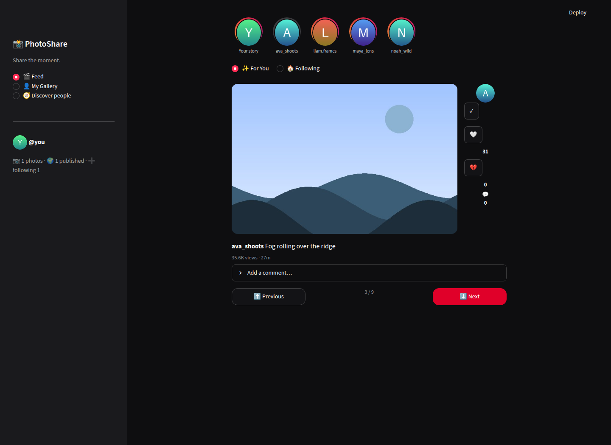
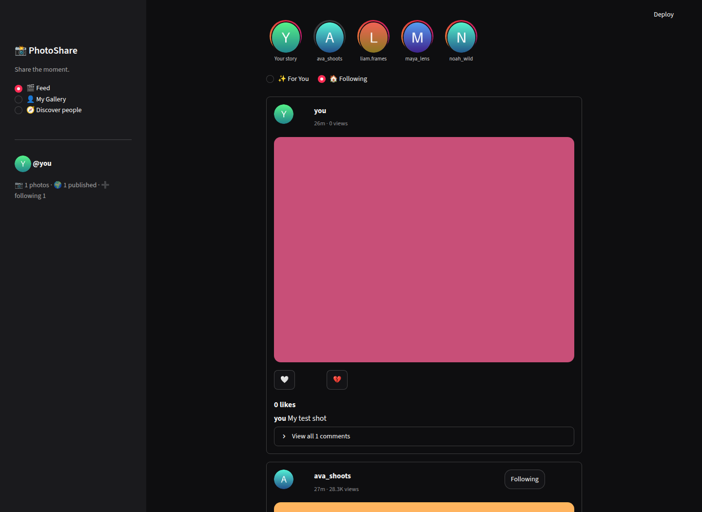
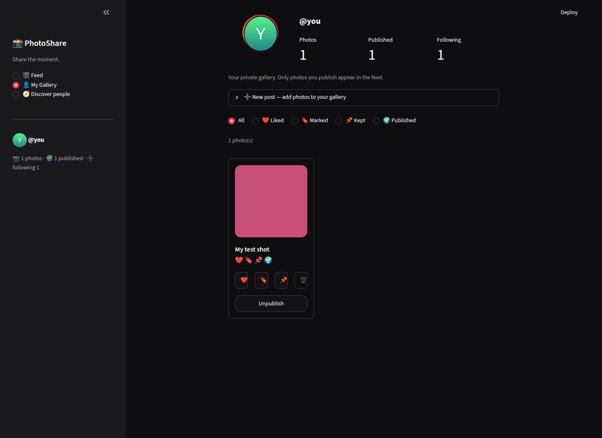
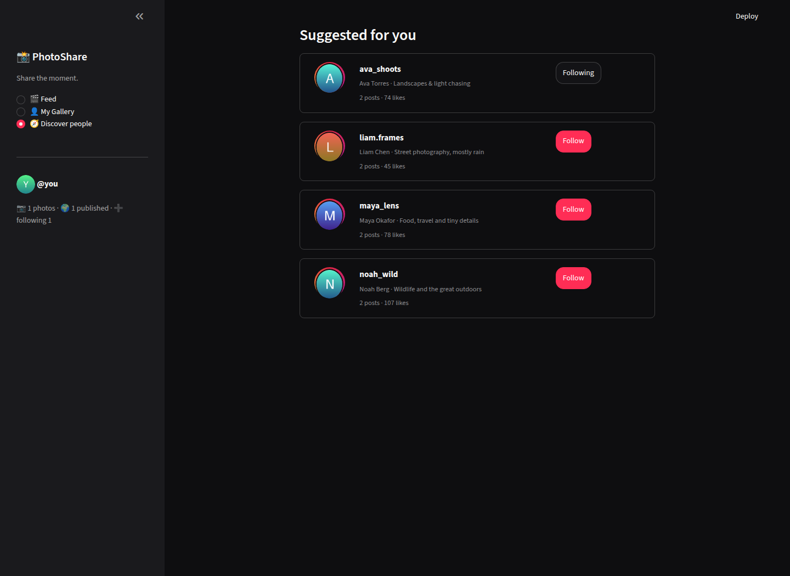

# 📸 PhotoShare

A photo sharing gallery app with a TikTok/Instagram-inspired look, built with
[Streamlit](https://streamlit.io).

## Preview

| ✨ For You (TikTok-style) | 🏠 Following feed (Instagram-style) |
| --- | --- |
|  |  |

| 👤 My Gallery (private profile) | 🧭 Discover people |
| --- | --- |
|  |  |

## Features

**✨ For You** — TikTok-style pager: one photo at a time with an action rail
(follow ➕, like ❤️, dislike 💔, comments 💬) and ⬆️/⬇️ navigation, plus
view counts. The feed is **unlimited** — new photos (and sometimes brand-new
creators) are procedurally generated just before you reach the end, across six
scene types: sunset ridges, ocean reflections, starry nights with auroras,
city skylines, desert dunes and bokeh abstracts.

**🏠 Following** — Instagram-style feed of people you follow:
- Stories bar with gradient rings and generated avatars
- ❤️ Like and 💔 dislike photos (vote again to withdraw, or switch your vote)
- 💬 Comment on any photo, 🔍 open a lightbox preview
- "Suggested for you" follow cards woven into the feed

**👤 My Gallery** — your private area, styled like an Instagram profile:
- ⬆️ Upload photos (png / jpg / gif / webp) with thumbnail preview before posting
- ❤️ Like, 🔖 Mark and 📌 Keep photos — kept photos are protected from removal
- 🗑️ Remove photos (deletes the image and takes it off the feed if published)
- 🌍 Publish photos to the feed, or unpublish them again
- 🔍 Full-size preview dialog, filters by Liked / Marked / Kept / Published

**🧭 Discover people** — suggested photographers with stats and follow buttons.

Every action is persisted to `data/photoshare.json` (and uploads to
`data/uploads/`), so your gallery actually changes and survives restarts.

## Run it locally

```
pip install -r requirements.txt
streamlit run streamlit_app.py
```

## Suggestions / roadmap ideas

- Multiple user accounts with sign-in, so friends get their own galleries
- Albums / collections inside My Gallery
- A "Saved" tab for bookmarking other people's photos
- Photo filters and edits (crop, brightness, black & white) on upload
- Video support for a true TikTok feel
- Notifications ("ava_shoots liked your photo") and an activity page
- Direct messages and photo sharing between users
- Hashtags and a search page for finding photos by topic
- A real database + object storage (e.g. Supabase or S3) instead of JSON,
  so the app can scale beyond a single machine
